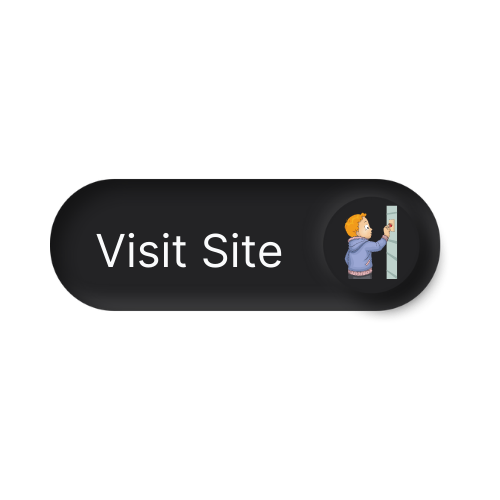

# Friends

   
   

A Simple Blog on one of the greatest sitcoms all time F.R.I.E.N.D.S. The Contents in the blog are completely inspired form different sites scattered among the interent.
This is just a fan made project.

## 

## Preview

    

--------------------------------------------------------------------------------------------------------------------------------------------------------------------
  
 
 

  
Contact Me: 

  
  
   
    

 
 ## ✍🏽 Author: NSVEGUR
